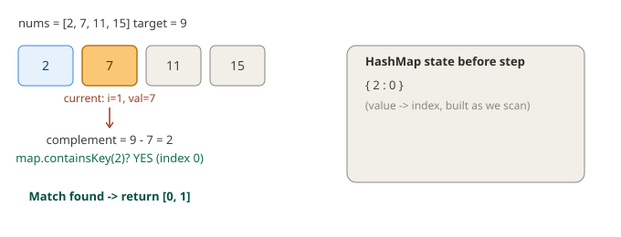

# 1. Two Sum

**Difficulty:** Easy
**Link:** [LeetCode](https://leetcode.com/problems/two-sum/)
**Pattern:** Hash Map (single pass)

## Problem

Given an array of integers and a target, return the indices of the two numbers that add up to the target. Exactly one valid answer exists.

## Intuition

The brute force checks every pair — O(n²). The key insight: for each number, we don't need to search for its *pair*, we need to know if its pair has *already been seen*. That reframes the problem from "search" to "lookup," which is what a hash map is for. Walk the array once, and before adding the current number to the map, check whether its complement (target - current) is already a key.

## Approach

1. Create an empty hash map of `value -> index`.
2. For each index `i` with value `v`:
   - Compute `complement = target - v`.
   - If `complement` is already a key in the map, return `[map.get(complement), i]`.
   - Otherwise, put `v -> i` into the map.
3. Continue until found (problem guarantees exactly one solution exists).

## Complexity

- **Time:** O(n) — single pass, O(1) average hash map lookup/insert.
- **Space:** O(n) — worst case stores all but one element before finding the match.

## Visual

## Solution

See [`Solution.java`](Solution.java)

## Edge cases considered

- Duplicate values in the array (e.g. `[3,3]`, target `6`) — works correctly because we check the complement *before* inserting the current value, so we never match an element with itself.
- No valid pair — not handled explicitly since LeetCode guarantees a solution exists; in a real system you'd throw or return an empty result.

## Follow-ups / variants

- What if the array is sorted? → two-pointer approach becomes O(n) time, O(1) space, trading the hash map for the sort order.
- What if we need *all* pairs, not just one? → same hash map idea, but collect all matches instead of returning early; watch for duplicate-pair double-counting.
- What if the input is a stream (can't hold it all in memory)? → discuss bounded windows / approximate structures depending on constraints — good staff-level follow-up to raise proactively.
