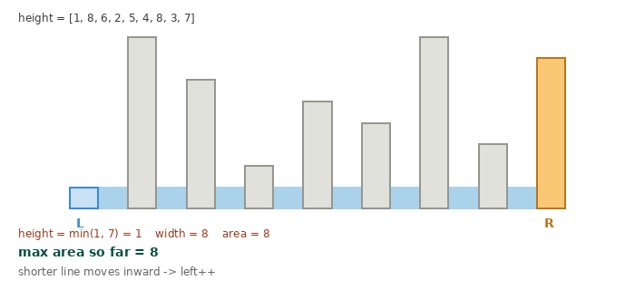

# 11. Container With Most Water

**Difficulty:** Medium
**Link:** [LeetCode](https://leetcode.com/problems/container-with-most-water/)
**Pattern:** Two Pointers

## Problem

Given an array of heights representing vertical lines, find the two lines that, together with the x-axis, form a container holding the most water.

## Intuition

Brute force checks every pair of lines, O(n^2). The two-pointer trick: start with the widest possible container (leftmost and rightmost lines) and shrink inward. At each step, the shorter of the two lines is the bottleneck limiting the area, so moving the taller line inward can never help (width shrinks, height is still capped by the same short line) — only moving the shorter line inward has a chance of finding a taller line that increases the area. That's the key insight that makes greedily moving the shorter pointer safe, without missing the optimal answer.

## Approach

1. Set `left = 0` and `right = n - 1`.
2. While `left < right`:
   - Compute `area = min(height[left], height[right]) * (right - left)`.
   - Update `max_area` if this area is larger.
   - Move the pointer at the shorter line inward (`left++` if `height[left] < height[right]`, otherwise `right--`).
3. Return `max_area` once the pointers meet.

## Complexity

- **Time:** O(n) — each pointer moves inward at most n times total.
- **Space:** O(1) — no extra data structures.

## Visual

## Solution

See [`Solution.java`](Solution.java)

## Edge cases considered

- All bars the same height — area is maximized by the widest pair, and the pointer logic still converges correctly since either side can move on ties.
- Two elements only (`n == 2`) — loop runs exactly once and returns immediately.
- A single very tall spike surrounded by short bars — the two-pointer approach still finds the optimum since it only discards pairs that are provably worse than what's already been seen.

## Follow-ups / variants

- What if you needed the actual pair of indices, not just the area? → track `best_left`/`best_right` alongside `max_area`.
- What if heights could be negative (below the x-axis)? → problem constraints rule this out here, but worth raising if an interviewer varies the constraints, since the "shorter line is the bottleneck" argument still holds as long as area is defined the same way.
