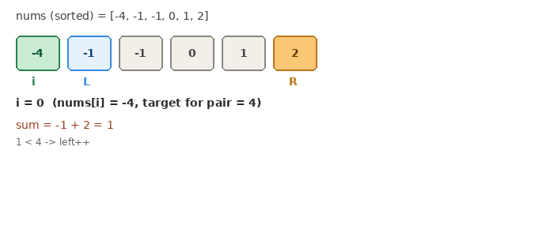

# 15. 3Sum

**Difficulty:** Medium
**Link:** [LeetCode](https://leetcode.com/problems/3sum/)
**Pattern:** Sorting + Two Pointers

## Problem

Given an array of integers, find all unique triplets that sum to zero. The same element can't be reused within a triplet, and the result must not contain duplicate triplets.

## Intuition

Brute force is O(n^3), checking every triplet. Sorting first unlocks a much cheaper approach: fix one element, and the remaining problem is exactly [Two Sum II](../0167-two-sum-ii-input-array-is-sorted) — find a pair in the (sorted) remainder that sums to `0 - nums[i]`. That collapses the inner search from O(n^2) to O(n) per fixed element, for O(n^2) total. Sorting also has a second benefit beyond enabling two pointers: it makes duplicate values sit adjacent to each other, which is what makes duplicate-triplet skipping simple.

## Approach

1. Sort `nums`.
2. For each index `i` from `0` to `n - 3`:
   - Skip `i` if `nums[i] == nums[i - 1]` — this ensures only the *first* occurrence of any duplicate run drives a full inner scan. (Skipping on `nums[i] == nums[i + 1]` instead would be wrong: it skips the wrong occurrence and can permanently exclude a valid triplet that needs to reuse an earlier duplicate as part of the pair, since `left` starts at `i + 1`.)
   - Set `target = -nums[i]`, `left = i + 1`, `right = n - 1`.
   - Two-pointer scan: if `nums[left] + nums[right] == target`, record the triplet, then skip past *runs* of duplicate values at both `left` and `right` (not just one step) before advancing both pointers inward. If the sum is too small, move `left` forward; if too large, move `right` backward.

## Complexity

- **Time:** O(n^2). The sort is O(n log n); the outer loop times the inner two-pointer scan is O(n^2). Two costs from sequential (not nested) phases add rather than multiply: O(n log n) + O(n^2) simplifies to O(n^2), since the quadratic term dominates as n grows.
- **Space:** O(log n) auxiliary space, from the recursion stack of the in-place sort (no extra array is allocated for sorting). The output itself can hold up to O(n^2) triplets in the worst case, but that's the unavoidable size of the answer, not extra working space the algorithm needs — worth stating both numbers to an interviewer rather than collapsing them into one.

## Visual

## Solution

See [`Solution.java`](Solution.java)

## Edge cases considered

- Array with fewer than 3 elements — loop bound `i < n - 2` naturally prevents any iteration.
- All zeros, e.g. `[0, 0, 0, 0]` — the outer skip and inner duplicate-skip logic both need to correctly collapse this to a single `[0, 0, 0]` triplet, not one per combination.
- No valid triplet exists — returns an empty list; nothing special required since `res` just never gets appended to.

## Follow-ups / variants

- What if the target sum weren't 0, but an arbitrary value `k`? → trivial change, just replace `target = 0 - nums[i]` with `target = k - nums[i]`.
- What about 4Sum? → same pattern one level deeper: fix two elements with nested loops, two-pointer scan the rest; complexity becomes O(n^3).
- What if the array were extremely large and didn't fit in memory? → worth raising as a follow-up even without a full answer: external sorting, or streaming/bucketing by value range, become relevant at that point.
