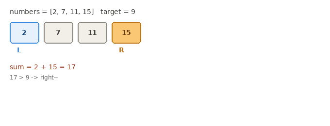

# 167. Two Sum II - Input Array Is Sorted

**Difficulty:** Medium
**Link:** [LeetCode](https://leetcode.com/problems/two-sum-ii-input-array-is-sorted/)
**Pattern:** Two Pointers

## Problem

Given a 1-indexed array sorted in non-decreasing order, find the two numbers that add up to a target and return their 1-indexed positions. Exactly one valid pair exists.

## Intuition

This looks like [Two Sum](../../arrays-hashing/0001-two-sum), but the sorted input changes the right tool for the job. Sorted order gives a monotonicity guarantee that unsorted input doesn't: moving the right pointer inward can only decrease or hold the sum (values only get smaller or equal moving left), and moving the left pointer inward can only increase or hold it (values only get larger or equal moving right). That guarantee is what makes a two-pointer sweep from both ends safe — each move provably eliminates the half of the search space that cannot contain the answer, without ever needing a hash map.

## Approach

1. Set `left = 0`, `right = n - 1`.
2. While `left < right`:
   - If `numbers[left] + numbers[right] == target`, return their 1-indexed positions immediately.
   - If the sum is less than target, move `left` forward (need a bigger sum).
   - Otherwise move `right` backward (need a smaller sum).

## Complexity

- **Time:** O(n) — each pointer moves inward at most n times total, and the gap between them shrinks by exactly 1 every iteration, so the loop is bounded by n regardless of input values.
- **Space:** O(1) — only a fixed set of scalar variables, no extra data structures.

## Visual

## Solution

See [`Solution.java`](Solution.java)

## Edge cases considered

- Smallest valid input (n = 2) — loop runs exactly once and must find the match immediately, since the problem guarantees a solution exists.
- Duplicate values in the array — doesn't break the approach, since the pointers move based on the sum, not on value uniqueness.

## Follow-ups / variants

- **A subtle correctness note, not just a style nit:** an early version of this solution recorded the match but let the loop keep running afterward instead of returning immediately. Since the problem guarantees exactly one valid pair, that never produced a wrong answer here — but the correctness was being borrowed from the problem's constraint, not guaranteed by the code itself. If this pattern were reused somewhere multiple valid pairs could exist, continuing past the first match would let a later match silently overwrite the result. Returning (or breaking) immediately on match makes the code correct on its own terms.
- What if the array were unsorted? → back to the original Two Sum's hash map approach; two pointers only work because of the sorted-order monotonicity argument above.
- What if you needed all pairs summing to target, not just one? → still two pointers, but continue scanning (with duplicate-skipping logic, same idea as in [3Sum](../0015-3sum)) instead of returning on the first match.
